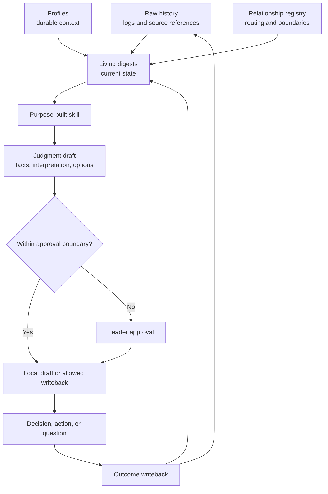

# Architecture

Leadership OS is a longitudinal practice, not a single assistant session. Its architecture keeps evidence, interpretation, decisions, and action distinct enough to review while allowing context to improve over time.

## System loop

## Information layers

### Raw history

Conversation and meeting logs preserve dated evidence with source references. They are append-only unless a correction is clearly noted. Raw history should be selective, not a transcript archive.

Examples:

- `people/<person>/conversation-log.md`
- `workstreams/<workstream>/meeting-log.md`

### Living digests

Digests answer, "What is currently true, uncertain, or important?" They are rewritten as the situation changes. Each material statement should point to dated evidence or be labeled as interpretation.

Examples:

- `me/weekly-digest.md`
- `people/<person>/digest.md`
- `workstreams/<workstream>/digest.md`

### Profiles

Profiles contain durable context that should remain useful across many weeks, such as working preferences, responsibilities, goals, and explicit boundaries. Temporary status belongs in a digest, not a profile.

Profiles for other people must contain only work-relevant, respectfully obtained context. Never use a profile as a hidden performance file or psychological assessment.

### Decisions

Decision records capture what was decided, by whom, when, why, and what evidence should later show whether the decision worked. A draft recommendation is not a decision. Only record a decision after the accountable person confirms it.

The personal index is `me/decisions-log.md`. Larger decisions can link to a dedicated record created from `templates/decision.md`.

### Relationship registry

`me/relationships.yml` is a routing layer. It identifies where a person's context lives and may record neutral working context such as role, relationship, or review cadence. It must not become a ranking, sentiment score, or source of inferred traits.

### Workflows

Workflows define repeatable operational steps. They specify inputs, allowed files, approval boundaries, failure behavior, and exit criteria. They answer how a practice runs.

### Skills

Skills apply a particular kind of judgment to current context. They define required evidence, a bounded reasoning process, and a stable output shape. They answer how an agent helps within a practice.

## Evidence model

Every meaningful output should distinguish:

- **Fact:** Directly supported by a cited source or a confirmed statement.
- **Interpretation:** A reasoned reading of one or more facts.
- **Decision:** A choice confirmed by the accountable human.
- **Open question:** A gap that must not be filled by assumption.
- **Proposed action:** A draft next step that may still require approval.

### Evidence precedence

When sources disagree, use this order:

1. A current official system of record.
2. A directly confirmed decision or correction from the accountable person.
3. A dated primary source, such as notes written during an event.
4. A later summary that cites primary sources.
5. An interpretation or recollection.

Higher precedence does not make a source universally public or safe to copy. Privacy rules still apply.

### Source-of-truth rules

- Keep official records in their official system. Store a reference and the minimum context needed to use it.
- Treat raw logs as history and digests as the current view.
- Do not silently rewrite raw evidence to match a later interpretation.
- Mark superseded facts and link to the correcting evidence.
- If a fact cannot be sourced, label it unverified or convert it to an open question.
- If two authoritative sources conflict, show the conflict and ask the accountable person to resolve it.

## Writeback loop

Writeback makes the system improve rather than merely produce outputs.

1. Capture a meaningful event or source reference.
2. Update the relevant digest with confirmed current context.
3. Record confirmed decisions and ownership.
4. After action, record the observable outcome.
5. Revisit earlier interpretation and mark what changed.

Writeback should be proportional. A small outcome may need one dated line, not a new document.

## Agent approval boundaries

### Allowed without separate approval

An agent may:

- read files the user has provided access to
- organize and summarize repository evidence
- label facts, interpretation, conflicts, and missing context
- draft local, reversible content in a clearly named draft section
- suggest file updates without applying them
- apply mechanical formatting or link fixes when asked to maintain the repository

### Approval required

An agent must ask before it:

- records a consequential judgment about another person
- turns an interpretation into a profile fact
- records a decision as final
- deletes or materially rewrites raw history
- moves sensitive information into a less restricted location
- sends a message, publishes content, or changes an external system
- makes commitments, assigns work, changes access, or acts on someone's behalf

### Never delegated to the agent

The accountable human owns:

- people, performance, compensation, hiring, and termination decisions
- strategic commitments and risk acceptance
- final interpretation where evidence is ambiguous
- permission to share another person's information
- exceptions to privacy or retention boundaries

## Portability

Markdown and YAML are the storage formats. Relative links are preferred. The core system must remain understandable in a text editor and usable without a specific model, plugin, database, or vendor integration.
