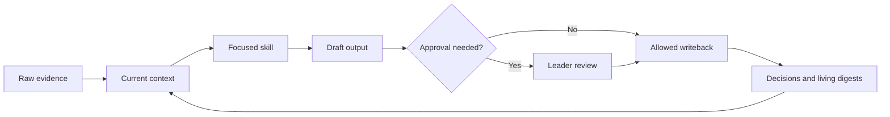

# Leadership OS starter

A small, Markdown-first way to keep useful leadership context over time.

Leadership work rarely stays in one lane. A morning might move from a 1:1 to a product question, a technical deep dive, and hands-on building. The details that make those conversations useful are often scattered across notes or left in memory.

This starter gives that context a simple home. AI can help organize evidence, notice patterns, and draft options, but you still make the calls.

Most of the work this starter supports is not code. It is designed for the GitHub Copilot app, where leaders and builders can keep conversation, repository files, focused skills, working artifacts, and separate sessions connected. The Markdown files remain portable and readable without Copilot.

The practice is a loop:

1. Save the evidence that will matter later.
2. Use a focused skill to work through a specific task.
3. Turn useful output into a decision, action, or open question.
4. Write confirmed outcomes back so the next conversation starts with better context.

Markdown remains the readable source of truth, with no plugin required. Version 1 has no integrations, credentials, database, dashboard, or scheduled automation.

## Everyday use

- Prepare for a 1:1 with past conversations, commitments, and open questions in view.
- Return to a product question without losing the decisions and tradeoffs that shaped it.
- Resume work after a few days without rebuilding the context from scratch.

## Who this is for

Use this starter if you lead people or work and want to:

- carry context across weeks instead of reconstructing it each time
- distinguish sourced facts from interpretation
- use AI across different leadership modes without giving it decision authority
- keep personal, official, and public records within clear boundaries
- begin manually, then automate only practices that have earned trust

## How this differs from a second brain

A second brain usually helps collect and find information. A leadership OS keeps the context behind your work usable as situations change.

| Collection system | Leadership OS |
| --- | --- |
| Stores useful material | Keeps a current view tied to evidence |
| Retrieves related notes | Uses a focused skill with clear limits |
| Produces summaries | Separates facts, interpretation, decisions, and questions |
| Ends at an output | Saves confirmed outcomes for next time |
| Treats more capture as progress | Keeps only context that improves future leadership work |

This is not a meeting summarizer or knowledge graph, and it is not an autonomous assistant acting on your behalf. The agent helps you work with context. You remain responsible for interpretation, decisions, people actions, and external communication.

## Architecture



Raw logs preserve history. Living digests hold the current picture. Profiles hold context that stays useful. Decision records capture commitments and rationale. Skills and workflows set clear limits on how an agent may use and update them. See [ARCHITECTURE.md](ARCHITECTURE.md) for the full model.

## Quick start in under 10 minutes

1. **Minute 1:** Click **Use this template** to create a private repository, or download and copy the files into a private folder. Do not add personal leadership context to a public fork.
2. **Minutes 2 to 4:** Open the repository in GitHub Copilot and use [`prompts/bootstrap.md`](prompts/bootstrap.md) to answer one question at a time.
3. **Minutes 5 to 6:** Save the resulting durable context in [`me/_profile.md`](me/_profile.md).
4. **Minutes 7 to 8:** Add current facts and source references to [`me/weekly-digest.md`](me/weekly-digest.md).
5. **Minutes 9 to 10:** Run the first prompt below and approve only the updates you want to keep.

Start with low-sensitivity material. Read [PRIVACY.md](PRIVACY.md) before adding information about another person.

## First three prompts

1. `Read README.md, PRIVACY.md, me/_profile.md, and me/weekly-digest.md. Help me identify the three leadership threads that most need attention this week. Separate facts, interpretation, and questions. Do not edit files.`
2. `Use the weekly-leadership-review skill. Draft a weekly review from the evidence already in this repository. Flag missing sources and ask for approval before updating any digest or decision record.`
3. `Use the leadership-os-audit skill. Check whether my digests are current, decisions are traceable, and private details are stored in the right place. Recommend the smallest useful cleanup.`

## Repository map

```text
.
├── .github/
│   ├── copilot-instructions.md
│   └── skills/
│       ├── README.md
│       ├── leadership-os-audit/SKILL.md
│       ├── manager-coaching-partner/SKILL.md
│       ├── product-design-partner/SKILL.md
│       ├── technical-sensemaking-partner/SKILL.md
│       └── weekly-leadership-review/SKILL.md
├── me/
│   ├── _profile.md
│   ├── decisions-log.md
│   ├── relationships.yml
│   └── weekly-digest.md
├── people/
│   └── example-person/
│       ├── _profile.md
│       ├── conversation-log.md
│       └── digest.md
├── prompts/
│   └── bootstrap.md
├── templates/
│   ├── conversation-entry.md
│   ├── decision.md
│   ├── digest.md
│   └── workstream.md
├── workflows/
│   ├── capture.md
│   ├── system-audit.md
│   └── weekly-review.md
├── workstreams/
│   └── example-workstream/
│       ├── digest.md
│       └── meeting-log.md
├── .gitignore
├── ARCHITECTURE.md
├── CONTRIBUTING.md
├── LICENSE
├── PRIVACY.md
└── README.md
```

## Skills

Skills are small instruction sets for recurring tasks. Each one names the evidence it needs, the steps it may take, the output it should produce, and what needs your approval before it is saved.

- [`weekly-leadership-review`](.github/skills/weekly-leadership-review/SKILL.md) connects the past week to current priorities and decisions.
- [`manager-coaching-partner`](.github/skills/manager-coaching-partner/SKILL.md) prepares evidence-based coaching without diagnosing or making people decisions.
- [`product-design-partner`](.github/skills/product-design-partner/SKILL.md) clarifies user problems, tradeoffs, and learning plans.
- [`technical-sensemaking-partner`](.github/skills/technical-sensemaking-partner/SKILL.md) builds an accurate technical model while preserving uncertainty.
- [`leadership-os-audit`](.github/skills/leadership-os-audit/SKILL.md) checks freshness, traceability, privacy, and writeback hygiene.

See [the skills guide](.github/skills/README.md) to customize or add a skill.

## Privacy reminder

This repository structure is public, but a populated leadership OS usually should not be.

- Do not copy private messages, credentials, medical details, compensation data, legal advice, or investigation material into the system.
- Do not treat inference as fact.
- Link to official systems of record instead of duplicating sensitive records.
- Get approval before sending messages, changing external systems, or recording consequential judgments about people.
- Review every file before publishing or sharing it.

The practical policy is in [PRIVACY.md](PRIVACY.md).

## Progressive roadmap

Keep each stage until it feels reliable.

1. **Manual context:** Maintain profiles, logs, digests, and decisions in Markdown.
2. **Repeatable practice:** Customize skills and run the documented workflows by hand.
3. **Assisted capture:** Add local, reviewable helpers that draft entries from user-provided material.
4. **Selective connections:** Consider read-only access to approved sources with clear provenance and retention rules.
5. **Careful automation:** Automate only stable tasks, keep visible logs, and require approval for external or consequential actions.

A later version can add a nightly review across approved sources. It should update only the context that matters, say when a source is incomplete, verify exact outcomes, and propose changes without silently rewriting the leader's plan.

Slack, WorkIQ, email, dashboards, databases, and scheduled workflows are possible later upgrades. They are intentionally not implemented in version 1.

## Contributing

Keep the starter compact, portable, and safe to make public. See [CONTRIBUTING.md](CONTRIBUTING.md).

Licensed under the [MIT License](LICENSE).
