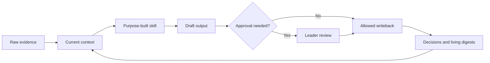

# Leadership OS starter

A small, Markdown-first system for building durable leadership context with AI.

Leadership work moves between people, strategy, product, technology, and hands-on building. The context behind those decisions is usually scattered across notes and memory. This starter gives that context a simple home without asking an agent to become the decision maker.

The practice is a loop:

1. Evidence becomes current context.
2. Purpose-built skills apply bounded judgment.
3. Useful outputs become decisions or action.
4. Outcomes are written back so future work starts with better context.

Everything is readable without a plugin. Version 1 has no integrations, credentials, database, dashboard, or scheduled automation.

## Who this is for

Use this starter if you lead people or work and want to:

- carry context across weeks instead of reconstructing it each time
- distinguish sourced facts from interpretation
- use AI across different leadership modes without giving it decision authority
- keep personal, official, and public records within clear boundaries
- begin manually, then automate only practices that have earned trust

## How this differs from a second brain

A second brain usually optimizes for collecting and finding information. A leadership OS optimizes for responsible continuity of judgment.

| Collection system | Leadership OS |
| --- | --- |
| Stores useful material | Maintains current context from cited evidence |
| Retrieves related notes | Applies a named, bounded workflow |
| Produces summaries | Separates facts, interpretation, decisions, and open questions |
| Ends at an output | Writes confirmed outcomes back into the system |
| Treats more capture as progress | Keeps only context that improves future leadership work |

This is not a meeting summarizer, knowledge graph, or AI chief of staff. The agent can organize evidence, surface patterns, and draft options. The leader remains accountable for interpretation, decisions, people actions, and external communication.

## Architecture



Raw logs preserve history. Living digests hold the current picture. Profiles hold durable context. Decision records capture commitments and rationale. Skills and workflows define how an agent may move between them. See [ARCHITECTURE.md](ARCHITECTURE.md) for the full model.

## Quick start in under 10 minutes

1. **Minute 1:** Fork or copy this repository into a private location for personal use.
2. **Minutes 2 to 4:** Open [`prompts/bootstrap.md`](prompts/bootstrap.md) with your AI tool and answer one question at a time.
3. **Minutes 5 to 6:** Save the resulting durable context in [`me/_profile.md`](me/_profile.md).
4. **Minutes 7 to 8:** Add current facts and source references to [`me/weekly-digest.md`](me/weekly-digest.md).
5. **Minutes 9 to 10:** Run the first prompt below and approve only the writeback you want to keep.

Start with low-sensitivity material. Read [PRIVACY.md](PRIVACY.md) before adding information about another person.

## First three prompts

1. `Read README.md, PRIVACY.md, me/_profile.md, and me/weekly-digest.md. Help me identify the three leadership threads that most need attention this week. Separate facts, interpretation, and questions. Do not edit files.`
2. `Use the weekly-leadership-review skill. Draft a weekly review from the evidence already in this repository. Flag missing sources and ask for approval before updating any digest or decision record.`
3. `Use the leadership-os-audit skill. Check whether my digests are current, decisions are traceable, and private details are stored in the right place. Recommend the smallest useful cleanup.`

## Repository map

```text
.
├── .github/
│   ├── copilot-instructions.md
│   └── skills/
│       ├── README.md
│       ├── leadership-os-audit/SKILL.md
│       ├── manager-coaching-partner/SKILL.md
│       ├── product-design-partner/SKILL.md
│       ├── technical-sensemaking-partner/SKILL.md
│       └── weekly-leadership-review/SKILL.md
├── me/
│   ├── _profile.md
│   ├── decisions-log.md
│   ├── relationships.yml
│   └── weekly-digest.md
├── people/
│   └── example-person/
│       ├── _profile.md
│       ├── conversation-log.md
│       └── digest.md
├── prompts/
│   └── bootstrap.md
├── templates/
│   ├── conversation-entry.md
│   ├── decision.md
│   ├── digest.md
│   └── workstream.md
├── workflows/
│   ├── capture.md
│   ├── system-audit.md
│   └── weekly-review.md
├── workstreams/
│   └── example-workstream/
│       ├── digest.md
│       └── meeting-log.md
├── .gitignore
├── ARCHITECTURE.md
├── CONTRIBUTING.md
├── LICENSE
├── PRIVACY.md
└── README.md
```

## Skills

Skills turn stored context into a repeatable practice. Each skill names its required evidence, limits its workflow, defines an output shape, and states what may be written without approval.

- [`weekly-leadership-review`](.github/skills/weekly-leadership-review/SKILL.md) connects the past week to current priorities and decisions.
- [`manager-coaching-partner`](.github/skills/manager-coaching-partner/SKILL.md) prepares evidence-based coaching without diagnosing or making people decisions.
- [`product-design-partner`](.github/skills/product-design-partner/SKILL.md) clarifies user problems, tradeoffs, and learning plans.
- [`technical-sensemaking-partner`](.github/skills/technical-sensemaking-partner/SKILL.md) builds an accurate technical model while preserving uncertainty.
- [`leadership-os-audit`](.github/skills/leadership-os-audit/SKILL.md) checks freshness, traceability, privacy, and writeback hygiene.

See [the skills guide](.github/skills/README.md) to customize or add a skill.

## Privacy reminder

This repository structure is public, but a populated leadership OS usually should not be.

- Do not copy private messages, credentials, medical details, compensation data, legal advice, or investigation material into the system.
- Do not treat inference as fact.
- Link to official systems of record instead of duplicating sensitive records.
- Get approval before sending messages, changing external systems, or recording consequential judgments about people.
- Review every file before publishing or sharing it.

The practical policy is in [PRIVACY.md](PRIVACY.md).

## Progressive roadmap

Keep each stage until it feels reliable.

1. **Manual context:** Maintain profiles, logs, digests, and decisions in Markdown.
2. **Repeatable judgment:** Customize skills and run the documented workflows by hand.
3. **Assisted capture:** Add local, reviewable helpers that draft entries from user-provided material.
4. **Selective connections:** Consider read-only access to approved sources with clear provenance and retention rules.
5. **Bounded automation:** Automate only stable tasks, keep visible logs, and require approval for external or consequential actions.

Slack, WorkIQ, email, dashboards, databases, and scheduled workflows are possible later upgrades. They are intentionally not implemented in version 1.

## Contributing

Keep the starter compact, portable, and safe to make public. See [CONTRIBUTING.md](CONTRIBUTING.md).

Licensed under the [MIT License](LICENSE).
